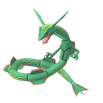
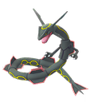
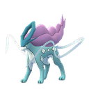
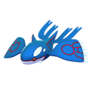
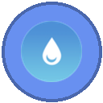

  

   

  

  <a href="#about">About</a> •
  <a href="#legendaries">Legendaries</a> •
  <a href="#skills">Skills</a> •
  <a href="#pokedex">Pokédex</a> •
  <a href="#experience">Experience</a> •
  <a href="#stats">Stats</a> •
  <a href="#achievements">Achievements</a> •
  <a href="#contact">Contact</a>

  
  
  

  

   

  
  
  

   
  ✨ shiny collection
   
  
  
  

### 🐉 Legendary Collection

  

<table>
  <tr>
    <td align="center"> <b>Articuno</b></td>
    <td align="center"> <b>Zapdos</b></td>
    <td align="center"> <b>Moltres</b></td>
    <td align="center"> <b>Mewtwo</b></td>
  </tr>
  <tr>
    <td align="center"> <b>Lugia</b></td>
    <td align="center"> <b>Ho-Oh</b></td>
    <td align="center"> <b>Entei</b></td>
    <td align="center"> <b>Raikou</b></td>
  </tr>
  <tr>
    <td align="center"> <b>Suicune</b></td>
    <td align="center"> <b>Groudon</b></td>
    <td align="center"> <b>Kyogre</b></td>
    <td align="center"> <b>Rayquaza</b></td>
  </tr>
  <tr>
    <td align="center"> <b>Dialga</b></td>
    <td align="center"> <b>Palkia</b></td>
    <td align="center"> <b>Giratina</b></td>
    <td align="center"> <b>Arceus</b></td>
  </tr>
</table>

### 🧭 About Me

  

Software Engineer specializing in **Speech AI**, **telephony-grade audio pipelines**, and **LLM inference optimization**. I build and ship production STT → LLM → TTS pipelines for real-time voice platforms — tuning streaming inference for low latency and building evaluation frameworks for model quality and regression testing.

- 🎙️ **Telephony Voice Pipelines** — SIP trunking, call routing, streaming audio, and real-time conversational flows, end-to-end latency down to **~1.15s**
- 🧠 **LLM Fine-Tuning** — LoRA, QLoRA, SFT, DPO, PEFT, and full fine-tuning for speech & language models
- ⚡ **Inference Optimization** — ONNX, TensorRT, llama.cpp, quantization, prefill/decode tuning, and Dynamo inference scheduling
- 🔍 **RAG Evaluation** — hallucination detection, answer relevance, and context scoring with offline evaluation & regression testing
- 📈 **Observability** — Prometheus, Grafana, cAdvisor, and Node Exporter for production monitoring
- 🎓 **B.E. Computer Science (AI & ML)** — Osmania University

### 🎯 Skills

#### 🗣️ Speech & Voice AI

  
  
  
  
  
  

#### 🧠 AI / Machine Learning

  
  
  
  
  
  
   
  
  
  
  
  

#### ⚡ Model Optimization & Evaluation

  
  
  
  
  
  
  

#### 💻 Languages

  
  
  
  
  

#### 🛠️ Backend & Frontend

  
  
  
  
  
  
   
  
  
  

#### 🗄️ Databases & MLOps

  
  
  
  
  
  
  
  

#### 🏅 Poké-Badges — Skill Categories

  
  
  
  
   
  <b>Voice AI</b> &nbsp;•&nbsp; <b>Backend</b> &nbsp;•&nbsp; <b>AI / LLM</b> &nbsp;•&nbsp; <b>MLOps</b>

### 📖 Pokédex (Projects)

  

- **#150**  · [`Employee Attrition Predictor`](https://github.com/Suchakra8555/Employee_attrition_predictor) — ML web app that predicts employee attrition with feature engineering and selection, delivering actionable retention insights to HR teams (Flask).
- **#250**  · **In-House LLM Summarization App** — enterprise document summarization using fine-tuned DistilBART, with an automated end-to-end workflow for knowledge management.
- **#384**  · [`DeepFakeDetection`](https://github.com/Suchakra8555/DeepFakeDetection) — college major project detecting deepfakes with the CoDE model.

  

### 💼 Experience

  

####  Software Engineer — CloudAngles, Hyderabad *(May 2026 – Present)*
- Engineered the complete **telephony-grade audio pipeline** for an enterprise Voice AI platform — SIP trunking, call routing, STT, LLM inference, and TTS in one production streaming system.
- Designed scalable **SIP workflows** for reliable inbound/outbound AI voice calls, handling real-time telephony audio end to end.
- Reduced end-to-end voice conversation latency to **~1.15s** through streaming inference and pipeline optimization across the STT/LLM/TTS stack.
- Integrated **Dynamo** for self-hosted LLM inference, optimizing scheduling for low-latency streaming responses.
- Analyzed and optimized the LLM **prefill and decode phases**, improving throughput and cutting response latency.

####  Software Engineer Trainee — CloudAngles, Hyderabad *(Aug 2025 – Apr 2026)*
- Architected scalable infrastructure for an **LLM fine-tuning platform**: staging environments, model hub, deployment pipelines, and experiment management.
- Built a fine-tuning framework supporting **LoRA, QLoRA, SFT, DPO, PEFT**, and full fine-tuning for speech & language models.
- Automated **MLOps pipelines** for dataset management, experiment tracking, model versioning, and deployment.
- Developed model optimization pipelines with **llama.cpp, ONNX, and TensorRT** (quantization + runtime conversion) for faster production inference.
- Implemented **RAG evaluation pipelines** — hallucination detection, answer relevance, context scoring — with offline evaluation and regression testing for model releases.
- Integrated **Prometheus, Grafana, cAdvisor, and Node Exporter** for production monitoring.

####  GenAI Developer Intern — CloudAngles, Hyderabad *(Mar 2025 – Jul 2025)*
- Built a centralized monitoring dashboard for internal AI products and integrated custom **computer vision models** with Roboflow.
- Developed **LangGraph AI agents** to automate enterprise workflows and reusable UI components for chatbot/agent platforms.

####  SDE Intern — Prathibha Innovations, Hyderabad *(Dec 2024 – Jan 2025)*
- Built a custom user management system with **Express.js** and configured **Prisma ORM** for scalable database operations.

### 📊 Stats & Activity

  
  

  

### 🏆 Achievements

  

- 🏅 **Gold Medal** — State Level Science Talent Search Examination (SLSTE), for excellence in science and analytical problem solving.

### 📬 Contact

- **LinkedIn**: [suchakra-kumar-gattu](https://www.linkedin.com/in/suchakra-kumar-gattu)
- **LeetCode**: [Suchakra_Kumar](https://leetcode.com/u/Suchakra_Kumar/)
- **Email**: suchakrakumargattu@gmail.com
- **Location**: Hyderabad, Telangana, India

  
  
  
  

  
   
  Made with ❤️ + 16-bit vibes. Pokémon GO sprites, cries & type art sourced from open asset projects; banner & divider SVG art are original.

